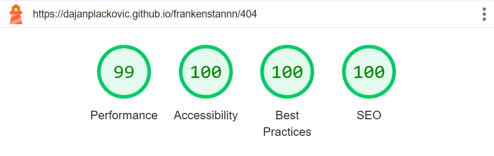
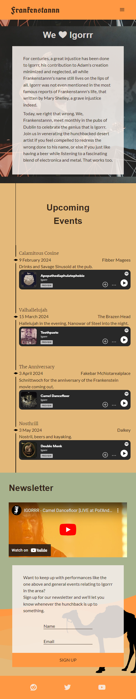

# Frankenstannn

Frankenstannn is a fictional fan club for Gautier Serre, also known as [Igorrr](https://igorrr.com/), a French black metal baroque breakcore trip hop musical artist.

The website provides information on Igorrr and the fan club, allows visitors to review the events organised by the fan club, as well as to sign up for the fan club newsletter. It is desert themed to follow the style of Igorrr's website, as well as **Spirituality and Distortion**, his best album.

Visit the deployed website [here](https://dajanplackovic.github.io/frankenstannn/).

## Table of Contents

1. [User Experience (UX)](#user-experience-ux)
   1. [Project Goals](#project-goals)
   2. [User Stories](#user-stories)
   3. [Color Palette](#color-palette)
   4. [Typography](#typography)
2. [Features](#features)
   1. [General](#general)
   2. [Header](#header)
   3. [Overview Section](#overview-section)
   4. [Upcoming Events Section](#upcoming-events-section)
   5. [Newsletter Sign Up Section](#newsletter-sign-up-section)
   6. [Footer](#footer)
   7. [404 Error Page](#404-error-page)
3. [Technologies Used](#technologies-used)
   1. [Languages Used](#languages-used)
   2. [Other Resources](#other-resources)
4. [Testing](#testing)
   1. [Testing User Stories](#testing-user-stories)
   2. [Code Validation](#code-validation)
   3. [Accessibility](#accessibility)
   4. [Manual Testing](#manual-testing)
      1. [Tests](#tests)
      2. [Unfixed Bugs](#unfixed-bugs)
5. [Finished Product](#finished-product)
6. [Deployment](#deployment)
   1. [GitHub Pages](#github-pages)
7. [Credits](#credits)
   1. [Content](#content)
   2. [Media](#media)
   3. [Code](#code)
   4. [Other](#other)
8. [Acknowledgements](#acknowledgements)

---

## User Experience (UX)

### Project Goals

- The website's design should follow a desert theme to match the album design of [Spirituality and Distortion](https://en.wikipedia.org/wiki/Spirituality_and_Distortion).

- Upcoming events should be presented in an easy to read and visually appealing timeline. The timeline should include samples of songs that will be heard at various events.

- A video showing a performance by Igorrr should be presented to indicate to users what a live event would look like.

- Users should have the option to sign up to a newsletter that will keep them up to date on other upcoming events.

### User Stories

- As a customer, I want all the information on the website to be available in one place.

- As a customer, I want to easily and quickly reach the overview of upcoming events and immediately see where they take place and if they involve music that would interest me.

- As a customer, I want to find links to the fan club social media pages.

- As a customer, I want to be able to easily sign up to the newsletter.

### Colour Palette

The colour palette used for the site consists of five primary colours and an additional two higher contrast colours used to make the text more readable:

- The two tones of orange (#ff9843 and #e4b97a) are used to convey the desert atmosphere.
- The three tones of turquoise (#a8b38e, #59897c and #50726a) are used to invoke an oasis. The darkest colour (#50726a) is also used for hover effects, as it contrasts well with the default orange.
- The brown (#342519) and transparent off white (#f5efeadf) are used to increase contrast where needed.

### Typography

All fonts used are imported from [Google Fonts](https://fonts.google.com/).

The main font used is [Lato](https://fonts.google.com/specimen/Lato), font weights 300 and 400, with sans-serif as a fallback.

Headings use [Merriweather](https://fonts.google.com/specimen/Merriweather) and [Merriweather Sans](https://fonts.google.com/specimen/Merriweather+Sans) with serif and sans-serif as fallbacks respectively.

The logo uses [UnifrakturCook](https://fonts.google.com/specimen/UnifrakturCook), as it is the closest approximation of [Igorrr's logo](https://igorrr.com/share-fb.jpg) I could find on Google Fonts.

[Back to top ⇧](#frankenstannn)

## Features

### General

- Responsive design across device sizes.

- A consistent colour scheme and design.

### Header

- The header contains the fan club logo and a nav bar.

- The logo functions as a link to the top of the page.

- The nav bar displays a hamburger menu on smaller device sizes.

### Overview Section

- A background image taken from Igorrr's website.

- A title, shown on top of the description on mobile and in a sticky position next to the description on larger devices.

- A short yet somehow still meandering description of the fan club, including references to Frankenstein by Mary Shelley.

### Upcoming Events Section

- A responsive timeline showing the following for each event:
  - Name
  - Date
  - Location
  - Sample music

### Newsletter Sign Up Section

- A YouTube embed showing a live performance by Igorrr.

- A sign up form for the newsletter

### Footer

- The footer includes links to the fan club's social media. (Since the club is imaginary, the links lead to the home pages of the various platforms.)

### 404 Error Page

- A simple 404 page, in case an invalid link is entered.

- Contains a link back to the homepage.

[Back to top ⇧](#frankenstannn)

## Technologies Used

### Languages Used

- [HTML5](https://en.wikipedia.org/wiki/HTML5)
- [CSS3](https://en.wikipedia.org/wiki/CSS)

### Other Resources

- [Google Fonts](https://fonts.google.com/)

  - Imported [Lato](https://fonts.google.com/specimen/Lato), [Merriweather Sans](https://fonts.google.com/specimen/Merriweather+Sans), [Merriweather](https://fonts.google.com/specimen/Merriweather) and [UnifrakturCook](https://fonts.google.com/specimen/UnifrakturCook).

- [Font Awesome](https://fontawesome.com) used for social media icons in footer.

- [Material Symbols](https://fonts.google.com/icons) used for menu icons in header on mobile.

- [Spotify](https://open.spotify.com/) used to generate iframe code for audio embeds.

- [YouTube](https://www.youtube.com/) used to generate iframe code for video embed.

- [Pixelied JPG to WEBP Converter](https://pixelied.com/convert/jpg-converter/jpg-to-webp) used to convert the background image from PNG to WEBP.

- [GitHub](https://github.com/) used to store repo.

- [Am I Responsive?](http://ami.responsivedesign.is/#) used to generate the image of the site on various screen sizes shown in the README.

- [Chrome DevTools](https://developer.chrome.com/docs/devtools/) used during development to debug and test device appearance on different screen sizes.

- [W3C Markup Validator](https://validator.w3.org/) used to validate the HTML code.

- [W3C CSS Validator](https://jigsaw.w3.org/css-validator/) used to validate the CSS code.

[Back to top ⇧](#frankenstannn)

## Testing

### Testing User Stories

- As a customer, I want all the information on the website to be available in one place.

  - The website presents all information on a single page.

  - Navigation between sections is made easy by an intuitive nav bar always displayed at the top of the page.

- As a customer, I want to easily and quickly reach the overview of upcoming events and immediately see where they take place and if they involve music that would interest me.

  - The upcoming events are shown straight under the first section and can easily be reached using the nav bar.

  - They show the time, location and associated music at a glance.

- As a customer, I want to find links to the fan club social media pages.

  - Footer contains social media links.

- As a customer, I want to be able to easily sign up to the newsletter.

  - Form simple to use and easy to access using the nav bar.

### Code Validation

- [W3C Markup Validator](https://validator.w3.org/) used to validate HTML for both pages. [No errors flagged for the 404 page,](https://validator.w3.org/nu/?doc=https%3A%2F%2Fdajanplackovic.github.io%2Ffrankenstannn%2F404.html) however a series of errors flagged for the homepage. [All have since been resolved.](https://validator.w3.org/nu/?doc=https%3A%2F%2Fdajanplackovic.github.io%2Ffrankenstannn%2Findex.html)
  

  - The `header` element contained another `header` within itself. The latter was changed to a `div` to avoid issues.
  - The `article` element containing the description in the overview section lacked a heading. Since it was not semantically an article, it was changed to a `div`.
  - Many unsupported `iframe` attributes were included in the iframe defaults copied over from Spotify and YouTube. These have since been removed.

- [W3C CSS Validator](https://jigsaw.w3.org/css-validator/) used to validate all three CSS files. [Two issues found and resolved.](https://jigsaw.w3.org/css-validator/validator?uri=https%3A%2F%2Fdajanplackovic.github.io%2Ffrankenstannn%2F&profile=css3svg&usermedium=all&warning=1&vextwarning=&lang=en)

  

  - The formatter in my code editor automatically removes spaces between a bracket and text. The space after `:has(` is significant, however, since it indicates the parent-child relationship between the two selectors. Changed this to `:has(> #menu` on both lines, as the direct child selector acts the same in this situation.

### Accessibility, SEO and Loading Speed

- Used Lighthouse in Chrome DevTools to test accessibility, SEO and site loading speed. Lighthouse flagged following issues, which have since been resolved:

  - Contrast between text and background on sign up button was too low.
  - There were no titles on the Spotify iframes.
  - There was no meta description for the website.

- Lighthouse reports

  - **Homepage**

  

  - **404 Page**

  

### Manual Testing

The below points were manually tested on the following device-browser combinations:

- On a **Lenovo ThinkPad T470** on the built-in **14" screen**, as well as a connected **20" monitor** in **Google Chrome**, **Mozilla Firefox** and **Microsoft Edge**

- On a **Google Pixel 6** phone in **Google Chrome**

#### Tests

All tests with no noted issues pass on all devices and in all browsers used to test.

- **Header**

  - Clicking on logo brings user to top of page.
  - Clicking on nav links brings user to the correct section.
  - Hovering over nav links triggers hover effect.
  - Hamburger menu displayed on mobile.
  - Clicking on hamburger menu opens mobile menu.
  - Clicking on link in mobile menu leads user to correct section.
    - While this works, the menu does not close, but needs to be closed manually. Usability issue.

- **Overview Section**

  - Elements are displayed responsively on different screen sizes.

- **Upcoming Events Section**

  - The timeline changes responsively according to screen size.
  - The embedded Spotify tracks play when clicked, but do not autoplay.
    - This works, but the volume is unbearably loud. Unfortunately, according to [this community post,](https://community.spotify.com/t5/Desktop-Windows/Add-volume-controller-on-Spotify-player-that-s-embeded-on-my/td-p/5040070) there does not seem to be a solution to this, as iframe volume cannot be modulated.

- **Newsletter Section**

  - The elements adjust responsively to screen size.
  - The YouTube embed plays when clicked, but does not autoplay.
  - The form labels animate when focused or when text is entered into input.
  - The form validates inputs and rejects empty ones.

- **Footer**

  - The social media links open the homepage of the relevant platform in a new tab.

- **404 Page**
  - 404 page is reached when invalid URL entered.
  - The link back to the homepage works.

#### Unfixed Bugs

- The mobile menu does not close after an item is clicked, but instead needs to be closed manually, which is at the very least a usability issue.

- While manually testing the embedded Spotify player, noticed the volume is annoyingly loud. Unfortunately, neither the iFrame embed nor the Spotify API currently offer an option to control embed volume, [as mentioned in this post from two years ago.](https://community.spotify.com/t5/Desktop-Windows/Add-volume-controller-on-Spotify-player-that-s-embeded-on-my/td-p/5040070) As a result, play volume is still super loud and annoying.

[Back to top ⇧](#frankenstannn)

## Finished Product

| Page     | Desktop version                                                     | Mobile version                                                     |
| -------- | ------------------------------------------------------------------- | ------------------------------------------------------------------ |
| Homepage |  |   |
| 404 Page |         |  |

[Back to top ⇧](#frankenstannn)

## Deployment

- This website was developed using [Visual Studio Code](https://code.visualstudio.com/), pushed to GitHub and then deployed to GitHub Pages.

### GitHub Pages

- Here are the steps to deploy this website to GitHub Pages from its GitHub repository:

  1. Log in to GitHub and locate the [GitHub Repository](https://github.com/).

  2. At the top of the Repository, locate the Settings button on the menu.

     - Alternatively click [here](https://raw.githubusercontent.com/) for a GIF demonstration of the process.

  3. Scroll down the Settings page until you locate the Pages section.

  4. Under Source, click the dropdown called None and select Master Branch.

  5. The page will refresh automatically and generate a link to your website.

[Back to top ⇧](#frankenstannn)

## Credits

### Content

- The genre breakdown of Igorr's style in README taken from the [Wikipedia article on Igorr.](https://en.wikipedia.org/wiki/Igorrr)
- All other content was written by the developer.

### Media

- The photo of Igorr in the first section of the home page is taken from [his website.](https://igorrr.com/)

- Favicons downloaded from [icons8.com.](https://icons8.com/icons/set/frankenstein)

### Design

- [A Color Hunt palette](https://colorhunt.co/palette/ff9843ffdd9586a7fc3468c0) was used as a basis for the website color scheme. [colormind.io](http://colormind.io/) was then used to extend it, [hover.dev's A CSS Color Palette Generator That Works](https://www.hover.dev/css-color-palette-generator) was used to generate the text and background colors, and [WebAIM's Contrast Checker](https://webaim.org/resources/contrastchecker/) to ensure the text and background colors allow for readability.

- The desert background for the SVG image used as a background for newsletter section was generated using [Haikei](https://app.haikei.app/). The two camel SVGs were taken from [SVG Silh](https://svgsilh.com/image/48445.html) and added onto the background using [Figma](https://www.figma.com/).

- Diamond for timeline also taken from [SVG Silh](https://svgsilh.com/image/37027.html).

### Code

- CSS reset template taken from [Eric A. Meyer's site.](https://meyerweb.com/eric/tools/css/reset/)

- Code used to make mobile menu symbols non-selectable taken from [W3 Schools.](https://www.w3schools.com/howto/howto_css_disable_text_selection.asp)

### Other

- [Color Combos Combo Maker](https://www.colorcombos.com/combomaker.html) used to generate colour palette image for README.

- [jossewe26's Pura Vida Spa README](https://github.com/josswe26/pura-vida-spa/blob/main/README.md) used as a basis for this file.

[Back to top ⇧](#frankenstannn)

## Acknowledgements

- Marta, for tolerating my often changing, inconsistent and time-consuming life and career plans.

- My family, for their useful feedback and inevitable joshing.

- My tutor, Marcel, for his patience, notes, feedback, encouragement and clear, precise pointers on what to focus on in moments of total disorientation.

- Code Institute for teaching me what I needed to know to make this site happen.

[Back to top ⇧](#frankenstannn)
